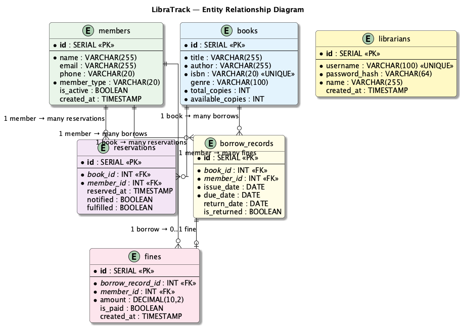
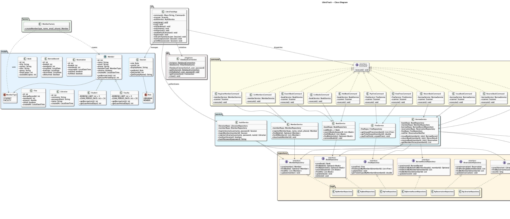
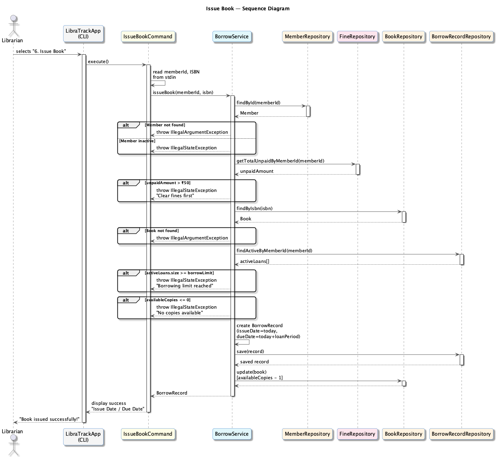
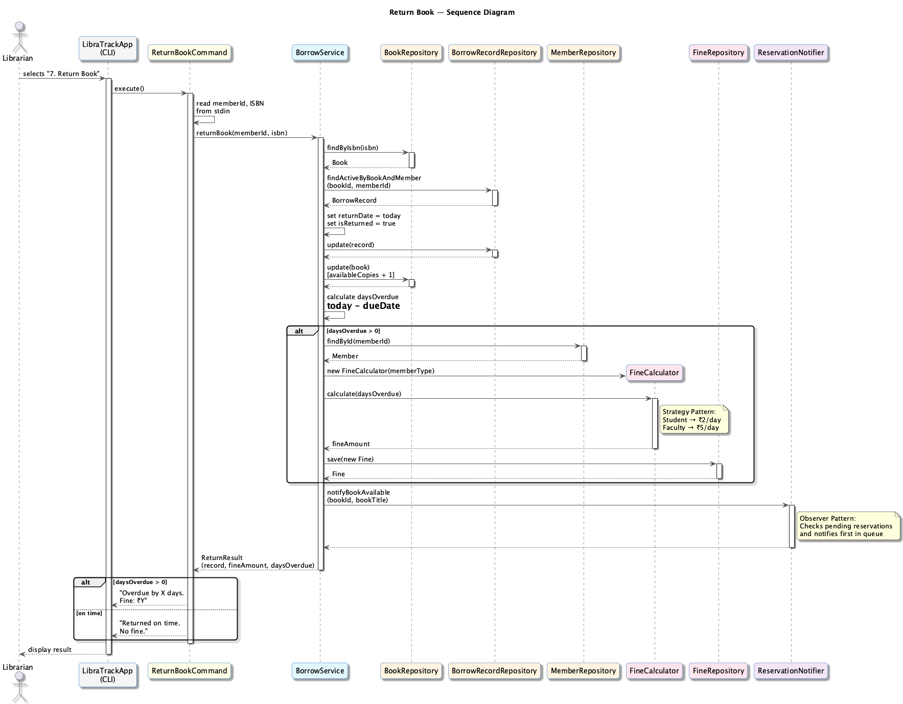
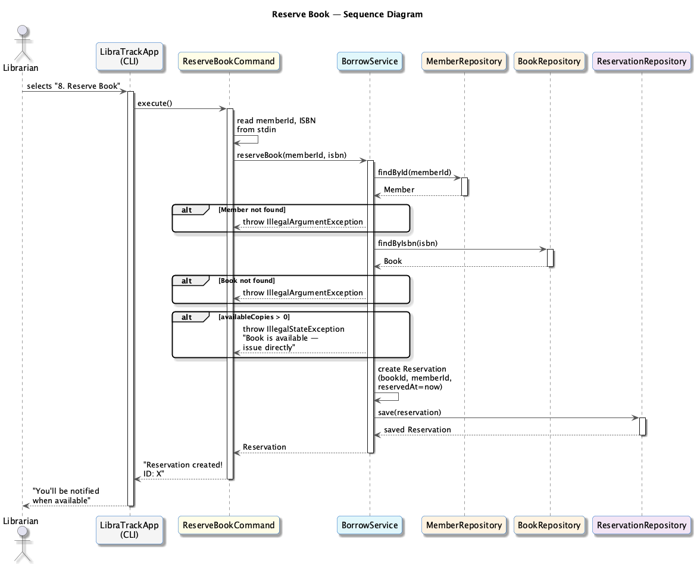

# UML Diagrams
## LibraTrack — University Library Management System

---

## 1. ER Diagram

### Relationships
- **BOOKS — BORROW_RECORDS:** 1:N (one book can be borrowed many times)
- **MEMBERS — BORROW_RECORDS:** 1:N (one member can have many borrow records)
- **BOOKS — RESERVATIONS:** 1:N (one book can have many reservations)
- **MEMBERS — RESERVATIONS:** 1:N (one member can reserve many books)
- **BORROW_RECORDS — FINES:** 1:0..1 (one overdue borrow may generate one fine)
- **MEMBERS — FINES:** 1:N (one member can have many fines)

---

## 2. Class Diagram

### Design Patterns Highlighted

| Pattern | Classes | Purpose |
|---------|---------|---------|
| **Singleton** | `DatabaseConnection` | Single shared connection pool |
| **Factory** | `MemberFactory` → `Student`, `Faculty` | Encapsulate member creation by type |
| **Strategy** | `FineStrategy` → `StudentFineStrategy`, `FacultyFineStrategy` | Swappable fine calculation (₹2/day vs ₹5/day) |
| **Observer** | `ReservationNotifier`, `BookAvailabilityObserver` | Notify on book availability |
| **Command** | `Command` → all `*Command` classes | Decouple CLI input from business logic |

---

## 3. Sequence Diagrams

### 3.1 Issue Book Flow

**Summary:** Librarian issues a book to a member. System validates member existence, active status, unpaid fines (max ₹50), borrowing limit, and book availability before creating a borrow record.

---

### 3.2 Return Book Flow

**Summary:** Librarian returns a book. System marks the record as returned, increments available copies, calculates fines if overdue using the **Strategy Pattern** (Student: ₹2/day, Faculty: ₹5/day), and triggers the **Observer Pattern** to notify pending reservations.

---

### 3.3 Reserve Book Flow

**Summary:** Librarian reserves a currently unavailable book for a member. System validates that the book is genuinely unavailable (if available, prompts to issue directly instead).
