# UML Diagrams
## LibraTrack — University Library Management System

---

## 1. ER Diagram

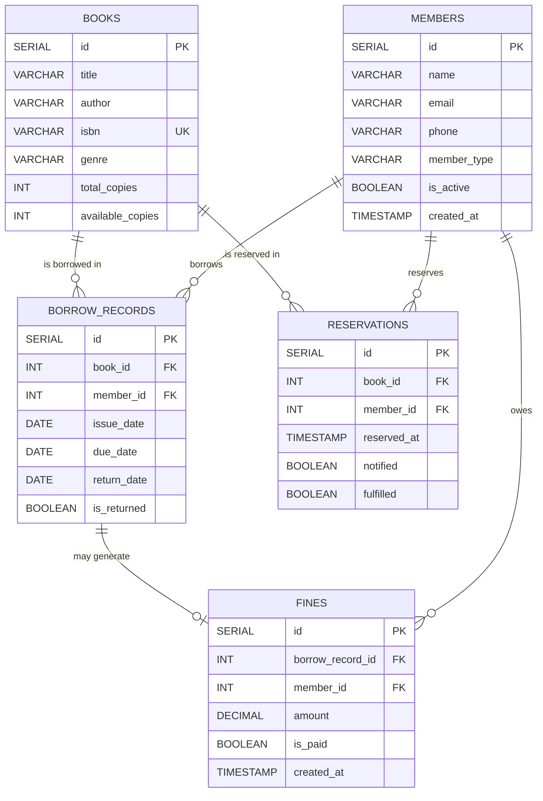

---

## 2. Class Diagram

### 2.1 Domain Models & Factory Pattern

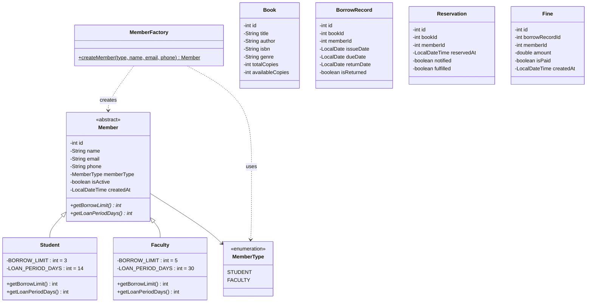

### 2.2 Strategy Pattern — Fine Calculation

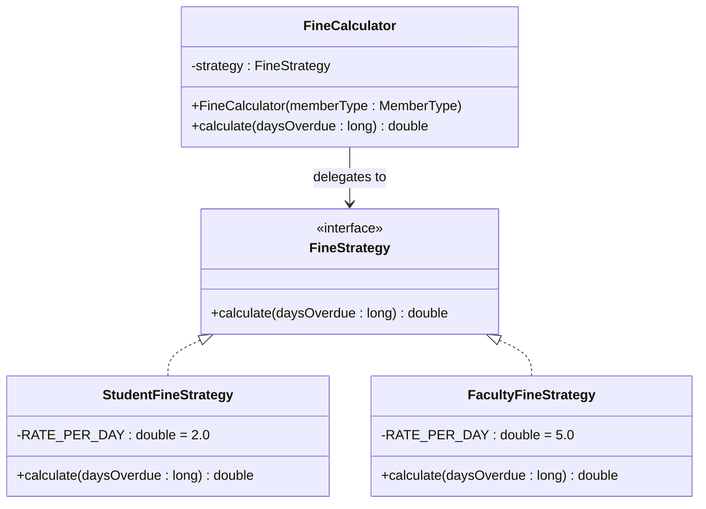

### 2.3 Observer Pattern — Reservation Notifications

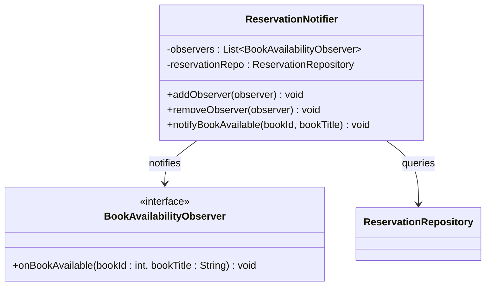

### 2.4 Command Pattern — CLI Dispatch

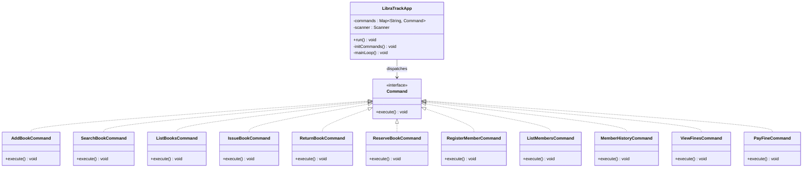

### 2.5 Singleton Pattern — Database Connection

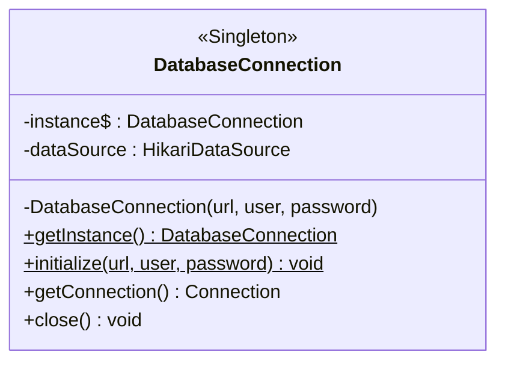

### 2.6 Repository Layer (Dependency Inversion)

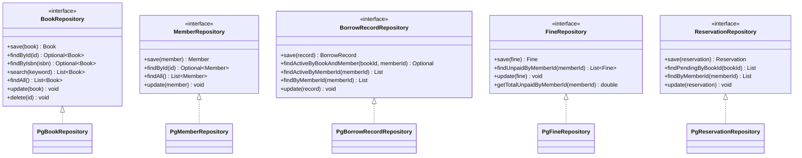

### 2.7 Service Layer

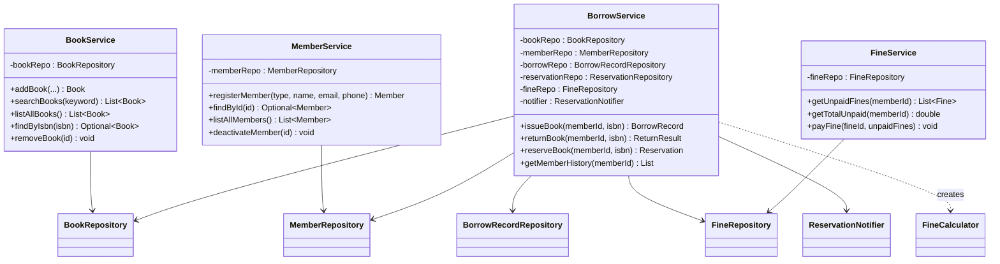

---

## 3. Sequence Diagrams

### 3.1 Issue Book Flow

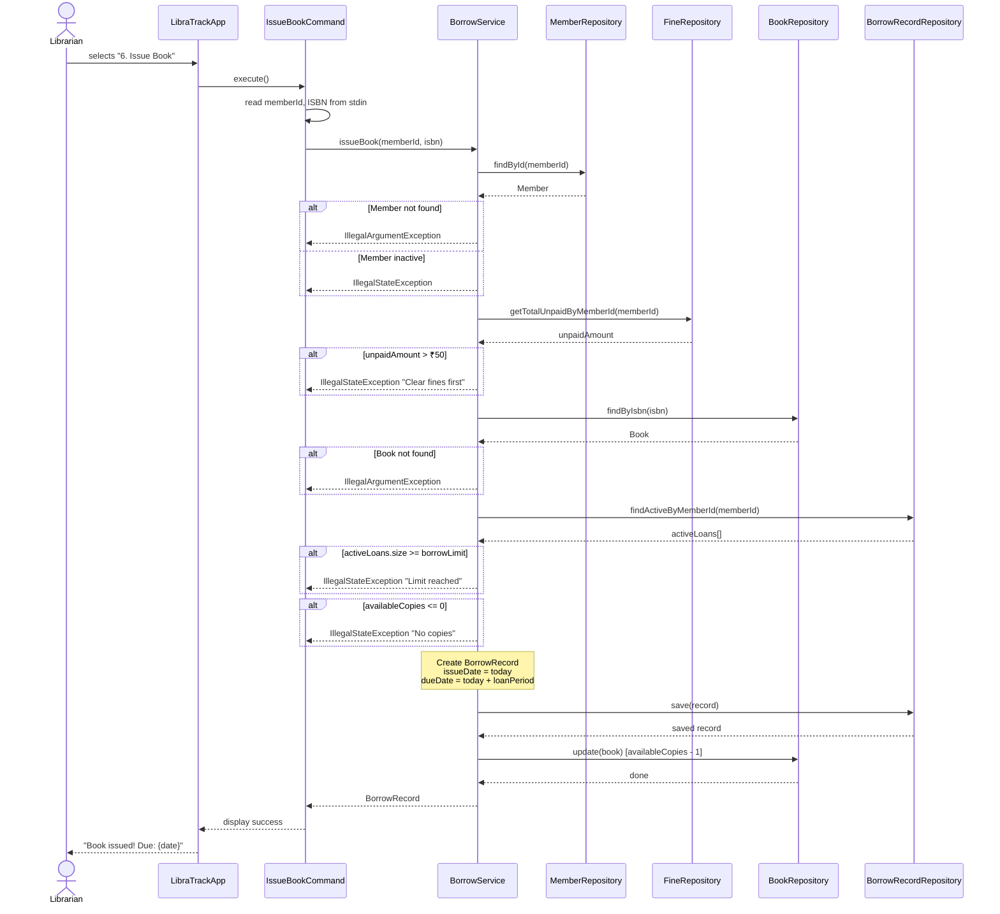

### 3.2 Return Book Flow

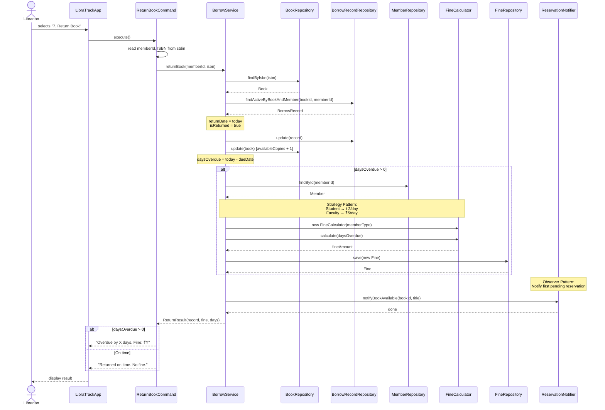

### 3.3 Reserve Book Flow

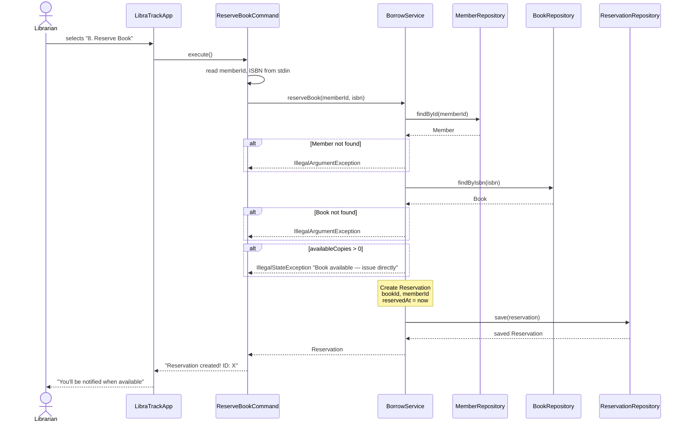
